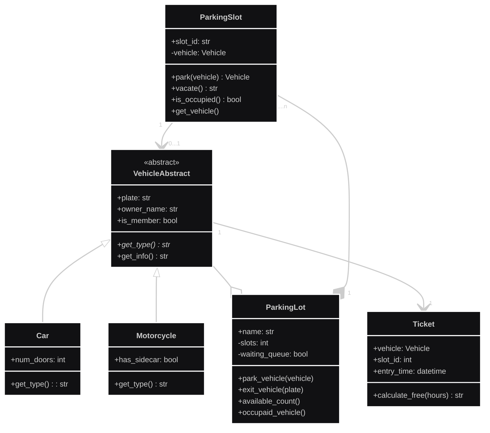

# Examen-Final-Poo

> **Desarrolladores:**  
> - Juan Diego Cuartas Casas  
> - Laura Juliana Espinosa Muñoz
> - Juan David Salgado Prieto

---

## Introduccion del problema: 

El problema a resolver, es un problema de organización el cual es enfocado al tema de parqueaderos dentro de un centro comercial, el cual tiene cupos fijos, donde solo puede entrar un solo vehículo, acepta tanto a carros como a motos y al entrar se da un ticket para al final cobrar por hora el cual tendrá descuento si el propietario es socio, la solución de este problema por medio de código se abarca desde Python usando los pilares de la programación orientada a objetos, planteando una base con el UML y usando cada parte del código como paquetes para la fácil lectura y escritura del código.

---

## UML

Este es el UML del problema de parqueaderos del centro comercial, el UML consta de clases con sus respectivos atributos y métodos, relaciones entre clases y multiplicidad. 
Se busca con el UML crear la base lógica del código a generar.


---

## Explicacion del codigo:

Para no quitarle la gracia al examen y exponerlo nosotros, en este apartado se hara una pequeña descripcion de cada parte del codigo de manera muy general y depronto algunas cosas especificas para poder ayudarnos a la hora de exponer el codigo.

### Vehiculo, carro, moto
La clase Vehiculo es la clase padre de la clase Carro y Moto. Aparte de esto, también es una clase abstracta que contiene un método abstracto (una clase abstracta no se puede instanciar directamente). Los atributos que tiene Vehículo los heredan Carro y Moto, después hace un polimorfismo en uno de sus métodos. Además de esto, la clase Vehículo tiene un atributo de ticket, que lo inicializa. Dejo por aquí la clase Vehículo; si se necesita profundizar en las demás clases, revisar las carpetas.

``` python 
from abc import ABC, abstractmethod
class Vehicle(ABC):
    def __init__(self, license_plate: str, owner_name: str, is_member: bool):
        self.license_plate = license_plate
        self.__owner_name = owner_name
        self._is_member = is_member
        self.ticket : 'Ticket' | None = None

    @abstractmethod
    def get_type(self):
        raise NotImplementedError("Las clases hijas deben redefinir este método de forma obligatoria.")
    
    def get_name(self):
        return self.__owner_name

    def __str__(self) -> str:
        raise NotImplementedError("Las clases hijas deben implementarlo.")
```
### Ticket
Ticket guarda el vehículo, el id del cupo y la hora de entrada usando datetime.now. Usa un patrón TYPE_CHECKING para anotar tipos de Car/Motorcycle sin generar importación circular con models/car.py y models/motorcycle.py y que tambien importan Ticket. calculate_fee() diferencia la tarifa según el tipo de vehículo con isinstance, y aplica 10% de descuento si el vehículo es socio. Dejo por aquí la clase Ticket.

``` python
from __future__ import annotations
from datetime import datetime
from typing import TYPE_CHECKING

if TYPE_CHECKING:
    from models.car import Car
    from models.motorcycle import Motorcycle

class Ticket:
    def __init__(self, vehicle: Car | Motorcycle , slot_id: str):
        self.vehicle = vehicle
        self.slot_id = slot_id
        self.entry_time = datetime.now()

    def calculate_fee(self) -> str:
        from models.car import Car

        time = datetime.now() - self.entry_time
        seconds = time.total_seconds()
        hours = seconds/3600

        valor_ticket: float = 0
        if isinstance(self.vehicle, Car):
            valor_ticket = 5000 * hours
            if self.vehicle._is_member:
                valor_ticket = valor_ticket * 0.90
        
        else:
            valor_ticket = 3000 * hours
            if self.vehicle._is_member:
                valor_ticket = valor_ticket * 0.90
        
        return (f"Cobro total: {valor_ticket}")
```


