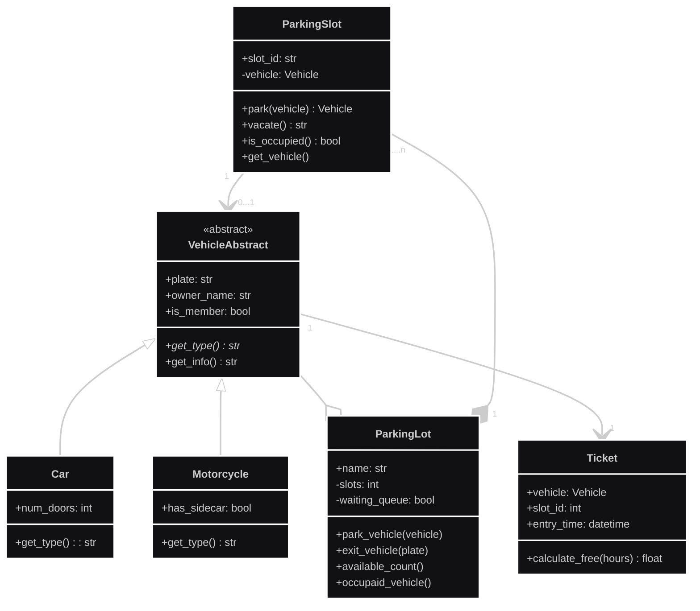

# Examen-Final-Poo
Este repositorio es para la presentacion del problema del examen final de programacion orientada a objetos (descripcion cambiable)

Este es el UML 

```mermaid
---
config:
  theme: redux-dark
  layout: dagre
---
classDiagram
direction TB


    class VehicleAbstract {
        <<abstract>>
        +plate: str
        +owner_name: str
        +is_member: bool
        +get_type() str *
        +get_info() str
    }

    class Car {
        +num_doors: int 
        +get_type(): str
    }

    class Motorcycle {
        +has_sidecar: bool
        +get_type() str
    }

    class ParkingSlot {
        +slot_id: str 
        -vehicle: Vehicle 
        +park(vehicle) Vehicle
        +vacate() str
        +is_occupied() bool
        +get_vehicle() 
    }

    class ParkingLot {
        +name: str
        -slots: int 
        -waiting_queue: bool
        +park_vehicle(vehicle)
        +exit_vehicle(plate)
        +available_count()
        +occupaid_vehicle()
    }

    class Ticket {
        +vehicle: Vehicle 
        +slot_id: int
        +entry_time: datetime
        +calculate_free(hours) float 
    }

    VehicleAbstract <|-- Car
    VehicleAbstract <|-- Motorcycle
    VehicleAbstract --o ParkingLot
    VehicleAbstract "1" --> "1" Ticket
    ParkingSlot "1" --> "0...1" VehicleAbstract
    ParkingSlot "1...n" --* "1" ParkingLot
```
