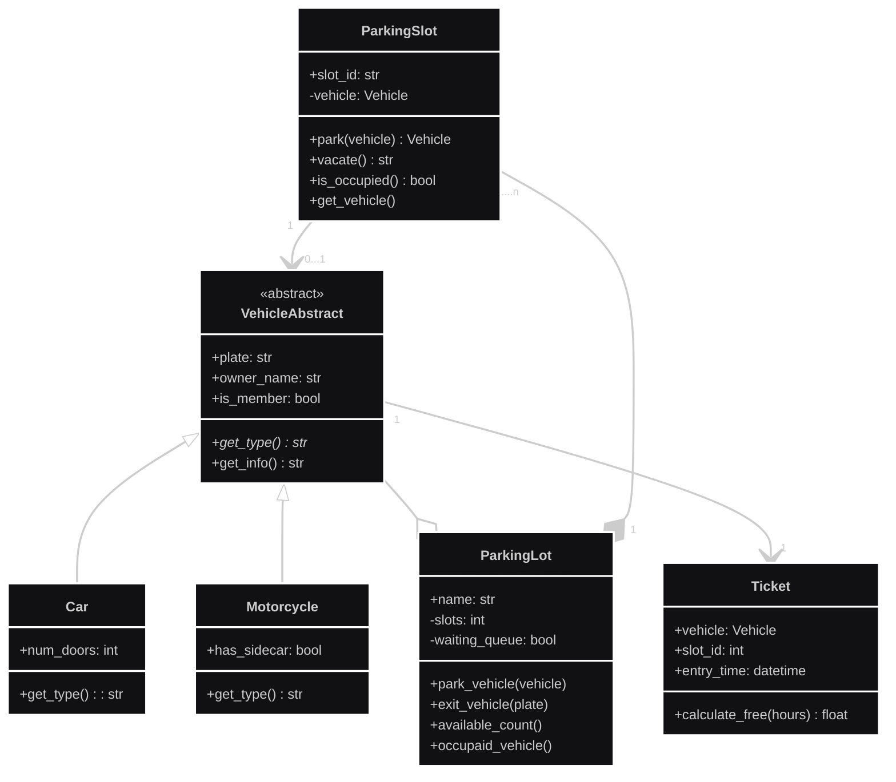

# Examen-Final-Poo

> **Desarrolladores:**  
> - Juan Diego Cuartas Casas  
> - Laura Juliana Espinosa Muñoz
> - Juan David Salgado Prieto

---

## Introduccion del problema: 

El problema a resolver, es un problema de organización el cual es enfocado al tema de parqueaderos dentro de un centro comercial, el cual tiene cupos fijos, donde solo puede entrar un solo vehículo, acepta tanto a carros como a motos y al entrar se da un ticket para al final cobrar por hora el cual tendrá descuento si el propietario es socio, la solución de este problema por medio de código se abarca desde Python usando los pilares de la programación orientada a objetos, planteando una base con el UML y usando cada parte del código como paquetes para la fácil lectura y escritura del código.

---

## UML

Este es el UML del problema de parqueaderos del centro comercial, el UML consta de clases con sus respectivos atributos y métodos, relaciones entre clases y multiplicidad. 
Se busca con el UML crear la base lógica del código a generar.

---

## Explicacion del codigo:
