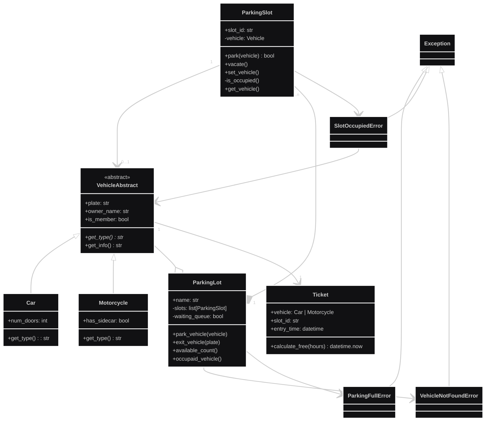

# Examen-Final-Poo

> **Desarrolladores:**  
> - Juan Diego Cuartas Casas  
> - Laura Juliana Espinosa Muñoz
> - Juan David Salgado Prieto

---

## Introduccion del problema: 

El problema a resolver, es un problema de organización el cual es enfocado al tema de parqueaderos dentro de un centro comercial, el cual tiene cupos fijos, donde solo puede entrar un solo vehículo, acepta tanto a carros como a motos y al entrar se da un ticket para al final cobrar por hora el cual tendrá descuento si el propietario es socio, la solución de este problema por medio de código se abarca desde Python usando los pilares de la programación orientada a objetos, planteando una base con el UML y usando cada parte del código como paquetes para la fácil lectura y escritura del código.

---

## UML

Este es el UML del problema de parqueaderos del centro comercial, el UML consta de clases con sus respectivos atributos y métodos, relaciones entre clases y multiplicidad. 
Se busca con el UML crear la base lógica del código a generar.


---

## Explicacion del codigo:
#### Para no quitarle la gracia al examen y exponerlo nosotros, en este apartado se hara una pequeña descripcion de cada parte del codigo de manera muy general y depronto algunas cosas especificas para poder ayudarnos a la hora de exponer el codigo.
---

### Vehiculo, carro, moto
La clase Vehiculo es la clase padre de la clase Carro y Moto. Aparte de esto, también es una clase abstracta que contiene un método abstracto (una clase abstracta no se puede instanciar directamente). Los atributos que tiene Vehículo los heredan Carro y Moto, después hace un polimorfismo en uno de sus métodos. Además de esto, la clase Vehículo tiene un atributo de ticket, que lo inicializa. Dejo por aquí la clase Vehículo; si se necesita profundizar en las demás clases, revisar las carpetas.

``` python 
from abc import ABC, abstractmethod
class Vehicle(ABC):
    def __init__(self, license_plate: str, owner_name: str, is_member: bool):
        self.license_plate = license_plate
        self.__owner_name = owner_name
        self._is_member = is_member
        self.ticket : 'Ticket' | None = None

    @abstractmethod
    def get_type(self):
        raise NotImplementedError("Las clases hijas deben redefinir este método de forma obligatoria.")
    
    def get_name(self):
        return self.__owner_name

    def __str__(self) -> str:
        raise NotImplementedError("Las clases hijas deben implementarlo.")
```
---
### Ticket
Ticket guarda el vehículo, el id del cupo y la hora de entrada usando datetime.now. Usa un patrón TYPE_CHECKING para anotar tipos de Car/Motorcycle sin generar importación circular con models/car.py y models/motorcycle.py y que tambien importan Ticket. calculate_fee() diferencia la tarifa según el tipo de vehículo con isinstance, y aplica 10% de descuento si el vehículo es socio. Dejo por aquí la clase Ticket.

``` python
from __future__ import annotations
from datetime import datetime
from typing import TYPE_CHECKING

if TYPE_CHECKING:
    from models.car import Car
    from models.motorcycle import Motorcycle

class Ticket:
    def __init__(self, vehicle: Car | Motorcycle , slot_id: str):
        self.vehicle = vehicle
        self.slot_id = slot_id
        self.entry_time = datetime.now()

    def calculate_fee(self) -> str:
        from models.car import Car

        time = datetime.now() - self.entry_time
        seconds = time.total_seconds()
        hours = seconds/3600

        valor_ticket: float = 0
        if isinstance(self.vehicle, Car):
            valor_ticket = 5000 * hours
            if self.vehicle._is_member:
                valor_ticket = valor_ticket * 0.90
        
        else:
            valor_ticket = 3000 * hours
            if self.vehicle._is_member:
                valor_ticket = valor_ticket * 0.90
        
        return (f"Cobro total: {valor_ticket}")
```
---

### Parking_Slot

ParkingSlot encapsula todo el comportamiento de un solo cupo, guarda su id, protege su propio estado, evita que lo ocupen mas de 1 objeto lanzando su propia excepción, genera el Ticket al parquear y libera el espacio al salir. Ahorita lo relacionaremos con la clase ParkingLot la usa como bloque de construcción para manejar el parqueadero completo. Dejo por aquí la clase Parking Slot.

``` python

import uuid
from models.ticket import Ticket
from exceptions.slot_occupied_error import SlotOccupiedError

class ParkingSlot:
    def __init__(self, id: str):
        self._id = id
        self._protected_ref = str(uuid.uuid1())[:5] 
        self._vehicle = None
        
         
    def __str__(self):
        return ( 
        f"Parqueadero numero :{self._id}\n"
        f"Parqueadero Ocupado: {self._is_occupied()}\n" # type: ignore
        f"{self.get_vehicle()}"
        )

    def park(self, vehicle) -> bool:
        if self._is_occupied():
            raise SlotOccupiedError("Puesto ocupado, intente con otro lugar", vehicle)
    
        else:
            self.set_vehicle(vehicle)
            vehicle.ticket = Ticket(vehicle, self._id)
            print(f"El vehiculo de placas {self._vehicle.license_plate} está parqueando en el espacio {self._id}\n") # type: ignore
            print(f"{self._vehicle.get_name()}, Gracias por ocupar nuestro espacio\n") # type: ignore
            return True
            
    def vacate(self):
        print(f"{self._vehicle.get_name()} , muchas gracias por su visita\n") # type: ignore
        self._vehicle = None


    def set_vehicle(self,vehicle):
        self._vehicle = vehicle
    
    def get_vehicle(self):
        return(self._vehicle)
    
    def _is_occupied(self):
        if self._vehicle:
            return True
        else: 
            return False
```
---

### Parking_Lot

ParkingLot gestiona el ciclo completo del parqueadero apoyándose en los métodos que ya se definieron en el ParkingSlot, en principio el código revisa si el lugar está ocupado o no, si no está ocupado el programa lo pone en lista de espera, también le da salida a el vehículo, le asigna el tiket cuando se va a retirar y calcula su precio. ParkingLot siempre se queda revisando si hay algún cupo disponible o para darle la entrada a el próximo vehículo. Dejo por aquí la clase Parking Lot.

``` python

from queue import Queue
from models.car import Car
from models.motorcycle import Motorcycle
from system.parking_slot import ParkingSlot
from exceptions.parking_full_error import ParkingFullError
from exceptions.vehicle_not_found_error import VehicleNotFoundError

class ParkingLot:
    def __init__(self, name: str, slots: list[ParkingSlot]):
        self.name = name
        self._slots= slots
        self._waiting_queue: Queue[Car | Motorcycle] = Queue()

    def park_vehicle(self, vehicle: Car | Motorcycle):
        try:
            for slot in self._slots:
                if not slot._is_occupied():
                    slot.park(vehicle)
                    return vehicle.ticket
               
            self._waiting_queue.put(vehicle)
            raise ParkingFullError(f"No hay cupos disponibles, se encuentra en lista de espera. Parqueaderos ocupados: {len(self._slots)}")
        except ParkingFullError as e:
            print (f"{e}\n")
            


    def exit_vehicle(self, plate: str):
        for slot in self._slots:

            if slot._is_occupied():
                vehicle = slot.get_vehicle()

                if vehicle and vehicle.license_plate == plate.upper():
                    fee = vehicle.ticket.calculate_fee()
                    slot.vacate()
                    print (f"La tarifa a pagar es de {fee}")

                    if not self._waiting_queue.empty():
                        next_v = self._waiting_queue.get()
                        slot.park(next_v)
                        print(f"El vehículo con placa {next_v.license_plate} ha sido parqueado en el puesto {slot._id}")

                    return
        try:
            raise VehicleNotFoundError(f"El vehiculo con placa {plate} no fue encontrado.")
        except VehicleNotFoundError as e:
            print(f"{e}\n")
                    
    def available_count(self):
        counter = 0
        available_slots = []

        for slot in self._slots:
            if not slot._is_occupied():
                available_slots.append(slot._id)
                counter +=1

        print(f"Parqueaderos disponibles: {counter}")
        if counter != 0:
            print("Los ID de éstos son:")

        for i, available_slot in enumerate(available_slots, start = 1):
            print(i, available_slot)

        return counter

    def occupied_vehicles(self):
        for slot in self._slots:
            if slot._is_occupied():
                yield slot._id, slot.get_vehicle()

```
---
## Excepciones

Dentro del código se generaron 3 excepciones para el manejo del código, diremos en que consiste cada una muy por encima para profundizar mejor en la sustentación.
- SlotOccupiedError: El cupo especifico ya tiene algún vehículo adentro.
- ParkingFullError: No hay cupo libre en algún lado.
- VehicleNotFoundError: No existe la placa en ningún parqueadero asignado o no hay vehículo con esa placa parqueado.

``` python

class ParkingFullError(Exception):
    def __init__(self,message):
        super().__init__(message)

```
---
``` python

from models.vehicle import Vehicle
class SlotOccupiedError(Exception):
    def __init__(self,message, vehicle: Vehicle):
        super().__init__(message)
        print(f"vehiculo de placas {vehicle.get_name()} estacionado en el slot")
```
---
``` python

class VehicleNotFoundError(Exception):
    def __init__(self,message):
        super().__init__(message)
```
---
### Cierre

De parte del grupo agradecemos a cada uno de los integrantes por haber trabajado todos por un mismo propósito y habiendo trabajado de buena cada uno de los integrantes del grupo (trabajo chill con personas chill).
